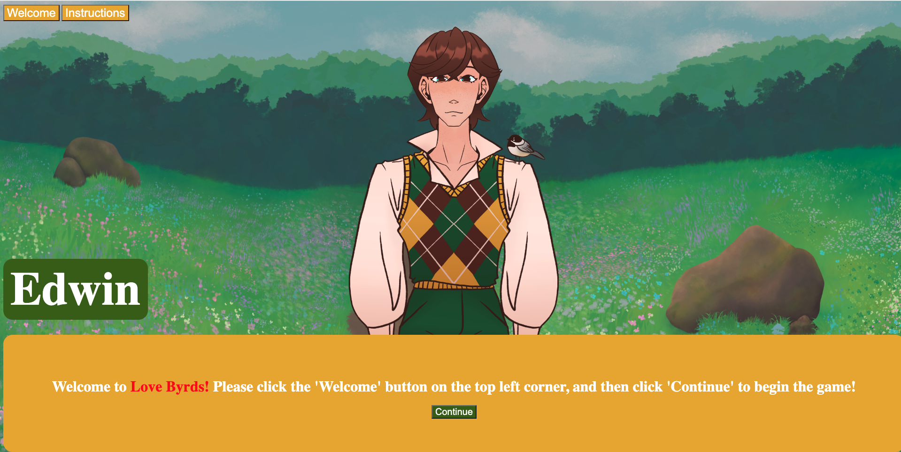
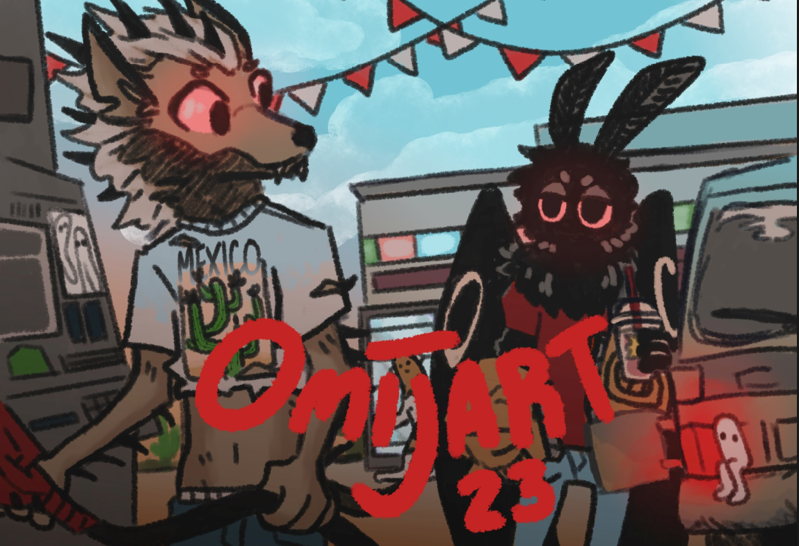

# Love_Byrds
### By: Theresa Kennelly

## Welcome to my Project!

[Love Byrds](https://love-byrds.surge.sh/)

Love Byrds is an interactable dating sim that has players answer a series of questions from their potential date: Holmen E. Byrds, or Edwin for short. Players will earn points based on Edwin's perception of their answers and by the end of their interaction, they will know if they are able to score a date with him!

By the end of this project there were still a few things I wanted to do, specifically, add some questions that had different types of input such as a submission box or drop-down menu. I had also hoped to make the UI look clean on all different aspect ratios.

## Tech

- JavaScript: Used to make interactions between player and bachelor functional.
- HTML: Used to build the frame of the game as well as all the UI for the instructions and introduction.
- CSS: Used to make things look nice (kind of).

## Wire Frame & Planning
- (https://www.figma.com/file/IFyxK82StJq4VzZusYvdTY/Project1%3A-Dating-Sim!?type=design&node-id=1-25&t=FViOZV0JNeHEggTc-0)
- (https://trello.com/b/1o0YecsR/project1-dating-sim)

## Credit:
Character Art:

Background Art:
HelloKeopi

